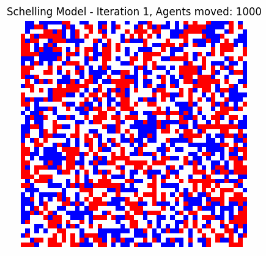

# Schelling’s Segregation Model — A Generative Agent-Based Simulation

## Overview

This repository contains a Python implementation of **Schelling’s Segregation Model**, a foundational example in **generative agent-based modeling (ABM)**. The model demonstrates how simple individual preferences can collectively generate complex, emergent patterns of residential segregation without centralized coordination.

Agents representing different groups occupy cells on a grid, each evaluating their local neighborhood and deciding whether to relocate based on a tolerance threshold for similar neighbors. Through iterative relocation, distinct clusters and segregated communities naturally emerge.



## Key Concepts

### Generative Agent-Based Modeling

- **Generative modeling** focuses on reproducing complex system-level phenomena by specifying simple, local agent behaviors.
- Agents autonomously generate actions based on local information, leading to emergent macro-level patterns.
- Schelling’s model exemplifies this paradigm by illustrating how micro-level preferences induce macro segregation.

### The Schelling Model Problem

- How do individual preferences about neighbors lead to spatial segregation?
- Even modest preferences for similar neighbors can result in significant clustering.
- The model underscores how segregation can arise without explicit discriminatory intent.


## Model Description

### Environment

- **Grid:** A two-dimensional square lattice representing the residential area.
- **Cells:** Each cell may be empty or occupied by an agent belonging to one of multiple groups.

### Agents

- **Groups:** Agents are categorized by group membership (e.g., ethnicity), each assigned a unique integer identifier.
- **Local View:** Agents perceive only their immediate neighbors (Moore neighborhood — up to 8 adjacent cells).
- **Satisfaction Criterion:** Agents are satisfied if the fraction of similar neighbors meets or exceeds a tolerance threshold.

### Parameters

| Parameter       | Description                                                  | Example       |
|-----------------|--------------------------------------------------------------|---------------|
| `grid_size`     | Dimension of the square grid (number of cells per side)      | 50            |
| `populations`   | Relative proportions of agents per group (must sum ≤ 1)      | `[0.2, 0.25, 0.3]` |
| `tolerance`     | Minimum fraction of similar neighbors for agent satisfaction | `0.3`         |
| `max_iters`     | Maximum simulation iterations                                 | 200           |
| `EMPTY`         | Integer representing an empty cell                           | `0`           |


## Usage

### Prerequisites

- Python 3.7+
- Required packages: numpy, matplotlib

## How to Run

Clone this repository:

```bash
git clone https://github.com/FarshadAmiri/ComplexSystems_playground/
cd schelling-abm
python run.py
